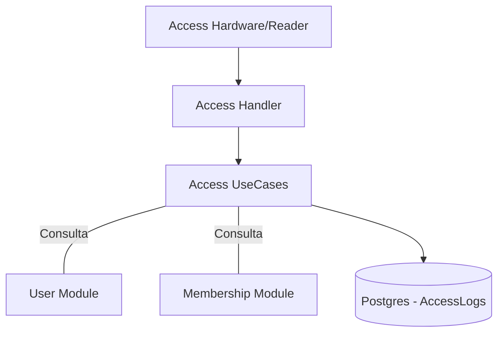

# 🔐 Módulo Access

El módulo **Access** es el responsable de la validación y registro de los ingresos y egresos físicos de los socios a las instalaciones del club.

## 🚀 Responsabilidad

Este módulo gestiona:
- **Validación de Credenciales:** Verificación de la identidad del socio y su estado actual.
- **Control de Reglas de Negocio:** Impide el ingreso si el socio no tiene una membresía activa o si posee deuda pendiente (integración con `Membership`).
- **Registro de Log (Auditoría):** Mantiene un historial detallado de quién entró, por dónde, en qué dirección y si el acceso fue otorgado o denegado (y por qué).
- **Soporte para Hardware de Terceros:** Diseñado para interactuar con molinetes, cerraduras inteligentes o lectores QR.

## ⚙️ Arquitectura

El módulo actúa como un guardián (gatekeeper) que consulta el estado consolidado del socio antes de permitir el paso:



## 🚥 Reglas de Acceso (Entry Logic)

Para el ingreso (`IN`), el sistema aplica las siguientes validaciones:
1. **Existencia:** El `UserID` debe ser válido.
2. **Estado de Membresía:** El socio debe tener al menos una membresía en estado `ACTIVE`.
3. **Estado Financiero:** Ninguna de las membresías activas puede tener un `OutstandingBalance > 0`.

## 💡 Snippets de Uso

### Solicitar Ingreso (Entry Request)
```go
request := application.EntryRequest{
    UserID:     "socio-uuid-123",
    Direction:  "IN",
    FacilityID: &piscinaUUID,
}

log, err := accessUseCase.RequestEntry(ctx, clubID, request)
if log.Status == domain.AccessStatusDenied {
    fmt.Println("Acceso denegado:", log.Reason) // ej. "Outstanding debt"
}
```

## ⚠️ Notas de Implementación
- **Idempotencia:** Cada intento de acceso se registra como un nuevo log, incluso si es denegado, para auditoría de seguridad.
- **Multitenancy:** Los logs de acceso están estrictamente aislados por `ClubID`.

⚠️ **Nota de Deuda Técnica:** Actualmente, el sistema no valida si el socio tiene una reserva activa para la instalación específica si se pasa un `FacilityID`. Se recomienda añadir una validación con el módulo de **Booking** para permitir el acceso solo en horarios reservados.
