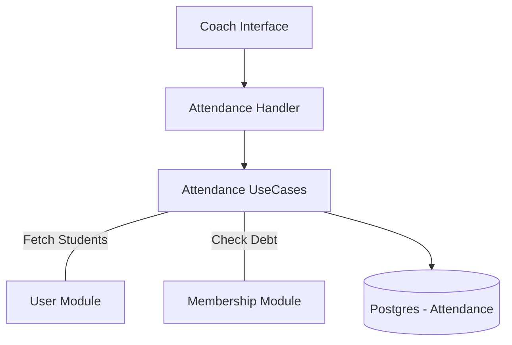

# 📋 Módulo Attendance

El módulo **Attendance** facilita a los entrenadores y coordinadores deportivos el registro de asistencia a las sesiones de entrenamiento y eventos del club.

## 🚀 Responsabilidad

Este módulo permite:
- **Toma de Asistencia Digital:** Reemplaza las planillas de papel por una interfaz móvil para los entrenadores.
- **Auto-población de Listas:** Al iniciar una clase, el sistema precarga a todos los alumnos que pertenecen a la categoría o grupo de entrenamiento correspondiente.
- **Visualización de Alerta de Deuda:** Permite al entrenador ver en tiempo real si un alumno tiene cuotas pendientes antes de permitirle participar en la clase (integración con `Membership`).
- **Historial de Presentismo:** Almacenamiento de registros individuales (`PRESENT`, `ABSENT`, `LATE`) para análisis de rendimiento y compromiso.

## ⚙️ Arquitectura

Colabora estrechamente con los módulos de usuarios y finanzas para proporcionar contexto al entrenador:



- **Populate Records:** El UseCase realiza consultas en batch para enriquecer la lista de alumnos con sus nombres, fotos y estado financiero de forma eficiente.

## 💡 Snippets de Uso

### Obtener o crear una lista del día
```go
// Busca la lista para el grupo "Sub-15" hoy. Si no existe, la crea y precarga alumnos.
list, err := attendanceUseCase.GetOrCreateList(clubID, "Fútbol Sub-15", time.Now(), coachID)
```

### Marcar presencia de un alumno
```go
dto := application.MarkAttendanceDTO{
    UserID: "socio-uuid-456",
    Status: domain.StatusPresent,
    Notes:  "Llegó 10 min tarde",
}

err := attendanceUseCase.MarkAttendance(clubID, listID, dto)
```

## ⚠️ Reglas de Negocio Críticas
1. **Detección de Deuda:** El campo `HasDebt` en el registro de asistencia se calcula dinámicamente consultando el balance en el módulo de Membership. Esto permite al entrenador tomar decisiones en campo (ej. "pasa por secretaría antes de entrenar").
2. **Historial Inmutable:** Una vez que se guarda una lista, los registros quedan persistidos para auditoría, aunque pueden ser editados por el mismo entrenador durante el día.

⚠️ **Nota de Deuda Técnica:** Actualmente, la asignación de alumnos a una lista se basa en el campo `category` del usuario (ej. 2012). Se recomienda migrar a una vinculación explícita con `TrainingGroups` para mayor precisión en clubes multideporte.
