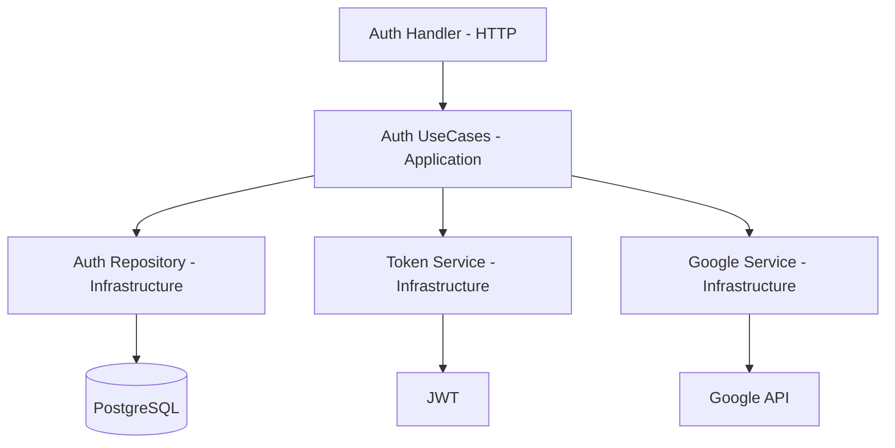

# 🔐 Módulo Auth

El módulo **Auth** es el núcleo de seguridad del sistema. Se encarga de la autenticación de usuarios, la gestión de sesiones mediante tokens (JWT) y la integración con proveedores externos como Google.

## 🚀 Responsabilidad

Este módulo gestiona el ciclo de vida de la identidad del usuario:
- **Registro y Login:** Autenticación local mediante email y contraseña (hasheada con bcrypt).
- **Google OAuth:** Login social utilizando Google Identity Platform.
- **Gestión de Sesiones:** Emisión y validación de Access Tokens (JWT) y Refresh Tokens (almacenados en DB para rotación segura).
- **Control de Acceso (RBAC):** Definición de roles (`SUPER_ADMIN`, `ADMIN`, `MEMBER`, `COACH`).
- **Auditoría:** Registro de logs de autenticación para seguimiento de seguridad.

## ⚙️ Arquitectura

El módulo sigue una arquitectura limpia (Clean Architecture) con flujo unidireccional:



- **Domain:** Define las entidades (`User`, `RefreshToken`) e interfaces del repositorio y servicios.
- **Application:** Implementa la lógica de negocio (casos de uso como `Register`, `Login`, `RefreshToken`).
- **Infrastructure:** Implementaciones concretas de persistencia (GORM/Postgres), tokens (JWT) y servicios externos.

## 🔑 Variables de Entorno

El módulo requiere la siguiente configuración para operar:

| Variable | Descripción | Obligatorio |
| :--- | :--- | :--- |
| `JWT_SECRET` | Clave secreta para firmar los tokens JWT. | Sí (en PROD) |
| `GOOGLE_CLIENT_ID` | Client ID de la consola de Google Cloud. | No (Opcional) |
| `GOOGLE_CLIENT_SECRET` | Secret de la consola de Google Cloud. | No (Opcional) |
| `GOOGLE_REDIRECT_URL` | URL de retorno tras autenticación en Google. | No (Opcional) |

## 💡 Snippets de Uso

### Cómo validar un token desde otro módulo
Normalmente, la validación se hace a través del middleware de Gin. Sin embargo, si necesitas validar manualmente:

```go
// Inyecta el TokenService en tu infraestructura/handler
tokenClaims, err := tokenService.ValidateToken(accessToken)
if err != nil {
    return nil, fmt.Errorf("token inválido: %w", err)
}

userID := tokenClaims.UserID
clubID := tokenClaims.ClubID
role := tokenClaims.Role
```

### Inyección de dependencias (Bootstrap)
```go
authRepo := repository.NewPostgresAuthRepository(db)
tokenService := token.NewJWTService(os.Getenv("JWT_SECRET"))
authUseCase := application.NewAuthUseCases(authRepo, tokenService, googleAuthService)
authHandler := authHttp.NewAuthHandler(authUseCase)
```

⚠️ **Nota de Deuda Técnica:** La gestión de IP y User Agent en los logs de autenticación se encuentra simplificada en la capa de UseCases. Se recomienda mover esta captura a la capa de Infraestructura/HTTP para mayor precisión.
