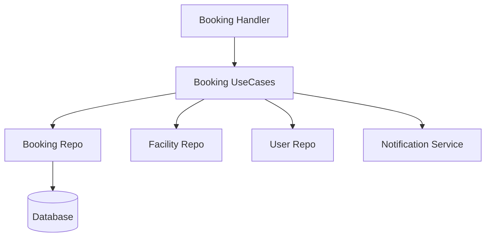

# 📅 Módulo Booking

El módulo **Booking** gestiona el ciclo de vida completo de las reservas de instalaciones deportivas, asegurando la integridad de los horarios y la aplicación de reglas de negocio del club.

## 🚀 Responsabilidad

Este módulo es responsable de:
- **Creación de Reservas:** Validación de disponibilidad, conflictos de horario y validación de certificado médico del usuario.
- **Reservas Recurrentes:** Definición de reglas para bloquear slots automáticos (ej. "Todos los lunes de 18:00 a 19:00").
- **Lista de Espera (Waitlist):** Gestión de usuarios interesados en horarios ya ocupados, con notificaciones automáticas tras cancelaciones.
- **Cálculo de Tarifas:** Aplica costos base por hora y cargos por invitados extras.
- **Ciclo de Vida de Pago:** Implementa un estado de "Pendiente de Pago" con expiración automática (Security Fix VUL-001) para evitar el bloqueo indefinido de canchas.

## ⚙️ Arquitectura

Sigue una arquitectura limpia, colaborando estrechamente con otros módulos core:



- **Inyección de Dependencias:** Los casos de uso de Booking requieren repositorios de `facilities` y `user` para validar reglas cruzadas (ej. estado de la cancha o validez del certificado médico).

## 💡 Snippets de Uso

### Crear una reserva desde otro servicio
Si bien las reservas suelen venir de la API, se pueden orquestar programáticamente:

```go
dto := application.CreateBookingDTO{
    UserID:     "uuid-usuario",
    FacilityID: "uuid-instalacion",
    StartTime:  time.Now().Add(24 * time.Hour),
    EndTime:    time.Now().Add(25 * time.Hour),
}

booking, err := bookingUseCase.CreateBooking(clubID, dto)
if err != nil {
    // Manejar error (Conflicto, Falta de Certificado Médico, etc.)
}
```

### Consultar disponibilidad
```go
date := time.Now().AddDate(0, 0, 1) // Mañana
slots, err := bookingUseCase.GetAvailability(clubID, facilityID, date)
// Retorna []map[string]interface{ "available": true, "status": "available", ... }
```

## ⚠️ Reglas de Negocio Críticas
1. **Certificado Médico:** Un usuario no puede reservar si su `MedicalCertStatus` no es `VALID` o si ha expirado.
2. **Mantenimiento:** Las reservas tienen prohibido solaparse con tareas de mantenimiento programadas en el módulo de `Facilities`.
3. **Expiración de Pago:** Si una reserva genera un costo (`total_price > 0`), nace como `PENDING_PAYMENT` y se libera tras 15 minutos si no se confirma el pago.

⚠️ **Propuesta de Mejora (Deuda Técnica):** Actualmente la consulta de disponibilidad realiza múltiples llamadas secuenciales (Instalación + Reservas + Mantenimiento). Se recomienda implementar `errgroup` para paralelizar estas consultas en entornos de alta concurrencia.
