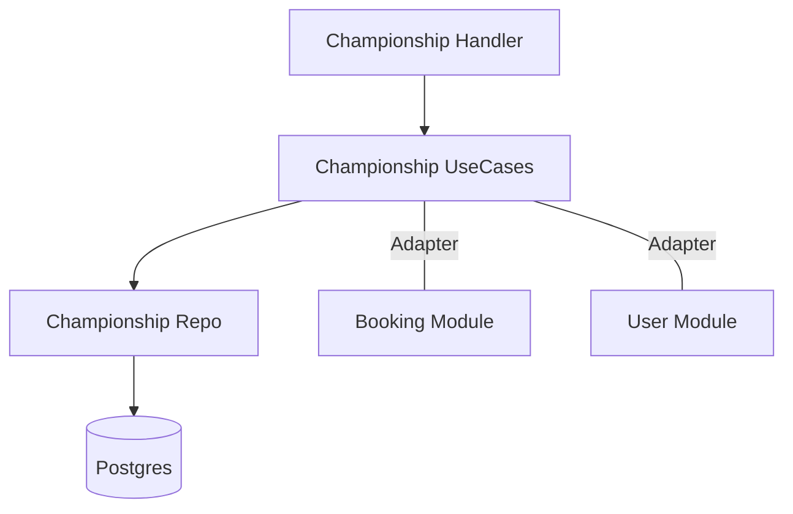

# 🏆 Módulo Championship

El módulo **Championship** es el encargado de orquestar la competitividad dentro del club, gestionando torneos, ligas y rankings.

## 🚀 Responsabilidad

Este módulo permite:
- **Gestión de Torneos:** Creación de competiciones por deporte (`FUTBOL`, `PADEL`, etc.) y categorías.
- **Estructura Multífase:** Soporte para fases de grupos (`GROUP`) y eliminación directa (`KNOCKOUT`).
- **Fixture Automático:** Generación algorítmica de enfrentamientos (Round Robin para grupos).
- **Tablas de Posiciones (Standings):** Recálculo automático de puntos, goles/puntos a favor, en contra y diferencia tras cargar resultados.
- **Sincronización de Reservas:** Programación de partidos directamente vinculada al módulo de **Booking**, bloqueando las canchas necesarias.
- **Gamificación:** Asignación de puntos de experiencia (XP) a los usuarios participantes tras finalizar los encuentros.

## ⚙️ Arquitectura

Colabora con otros servicios mediante interfaces para mantener el desacoplamiento:



- **Booking Adapter:** Permite crear reservas de sistema que no requieren pago por parte del jugador individual, ya que forman parte del torneo.

## 💡 Snippets de Uso

### Generar Fixture de un Grupo
```go
matches, err := championshipUseCase.GenerateGroupFixture(clubID, groupID)
if err != nil {
    // Manejar error (ej. menos de 2 equipos registrados)
}
```

### Cargar Resultado de un Partido
```go
input := application.UpdateMatchResultInput{
    ClubID:    clubID,
    MatchID:   matchID,
    HomeScore: 3,
    AwayScore: 1,
}

err := championshipUseCase.UpdateMatchResult(input)
// Esto dispara: Update DB -> Recalculate Standings -> Grant Player XP
```

## ⚠️ Lógica de Negocio Crítica
1. **Recálculo de Posiciones:** Al actualizar un resultado, se invalidan y vuelven a calcular todas las estadísticas del grupo para asegurar consistencia.
2. **Reserva de Canchas:** Si el módulo de **Booking** rechaza la reserva (ej. por mantenimiento), la programación del partido falla para evitar conflictos físicos en el club.
3. **Multi-tenancy:** Los torneos y sus equipos están aislados por `ClubID`, evitando filtraciones de datos entre diferentes instituciones.

⚠️ **Nota de Deuda Técnica:** La generación de fixture actualmente solo soporta Round Robin simple (todos contra todos una vez). Se recomienda expandir a ida y vuelta o estructuras de llaves (Brackets) más complejas para fases eliminatorias avanzadas.
