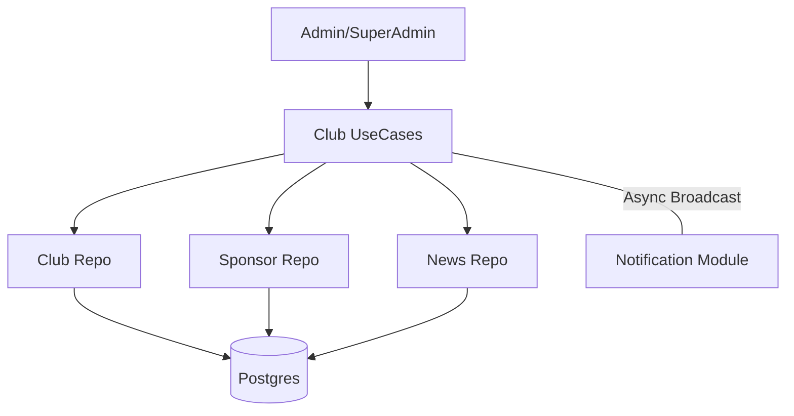

# 🏛️ Módulo Club

El módulo **Club** es el pilar de la arquitectura multi-tenant del sistema, gestionando la identidad de cada institución, sus noticias y su ecosistema de patrocinadores.

## 🚀 Responsabilidad

Este módulo centraliza:
- **Gestión de Entidades (Clubs):** Configuración de marcas, temas visuales (colores/logos) y dominios personalizados.
- **Portal de Noticias:** Sistema de publicación de novedades para los socios.
- **Integración de Patrocinios (Sponsors):** Gestión de auspiciantes y colocación de publicidad tanto física como digital.
- **Comunicación Masiva:** Difusión automática de noticias relevantes a todos los socios vía email.

## ⚙️ Arquitectura

Coordina la identidad del sistema y dispara procesos de comunicación:



- **Noticias con Notificación:** Al publicar una noticia con el flag `notify=true`, el sistema recupera todos los emails de los socios y dispara notificaciones asíncronas utilizando un **Semáforo de Concurrencia** para no saturar el servidor de correo.

## 💡 Snippets de Uso

### Publicar Noticia y Notificar a Socios
```go
// Publica y envía email a todos los miembros del club de forma asíncrona
news, err := clubUseCase.PublishNews(clubID, "Torneo de Verano", "Inscripciones abiertas...", "img_url", true)
```

### Registro de Patrocinador y Publicidad
```go
// Registra un sponsor y define dónde aparecerá su marca (ej. Banner en la web)
sponsor, _ := clubUseCase.RegisterSponsor(clubID, "Nike", "contacto@nike.com", "logo_url")
ad, _ := clubUseCase.CreateAdPlacement(sponsor.ID.String(), domain.LocationWebsiteBanner, "Home Top", expiryDate, 5000)
```

## 🚥 Reglas de Negocio Críticas
1. **Multitenancy Estricto:** Cada club tiene su propio `Slug` único que se utiliza en la URL del frontend (ej: `club-pulse.com/mi-club`).
2. **Control de Concurrencia:** En el envío masivo de notificaciones, se limita a 10 envíos concurrentes para garantizar la estabilidad del servicio.
3. **Publicidad Activa:** El sistema filtra automáticamente los `AdPlacements` cuya fecha de contrato haya expirado.

⚠️ **Nota de Deuda Técnica:** La configuración de `ThemeConfig` y `Settings` se almacena como JSON sin un esquema estrictamente tipado en el backend. Se recomienda definir structs específicos para los settings para evitar errores de parseo en el frontend.
