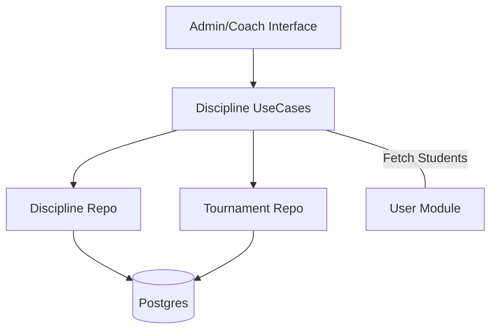

# 🎾 Módulo Disciplines

El módulo **Disciplines** gestiona la oferta deportiva del club, permitiendo organizar los distintos deportes, categorías de alumnos y sus respectivos entrenamientos.

## 🚀 Responsabilidad

Este módulo es responsable de:
- **Catálogo de Deportes (Disciplinas):** Definición de las actividades que ofrece el club (Tenis, Fútbol, Natación, etc.).
- **Grupos de Entrenamiento (Training Groups):** Creación de comisiones o grupos específicos por categoría (ej. "Sub-15"), asignación de entrenadores y definición de horarios.
- **Gestión de Alumnos:** Vinculación de socios a grupos según su año de nacimiento o nivel.
- **Torneos Integrados:** Capacidad para organizar campeonatos específicos por disciplina (registros de equipos, partidos y tablas de posiciones).

## ⚙️ Arquitectura

Gestiona la estructura pedagógica y competitiva básica del club:



- **Inyección de UserRepo:** Se utiliza para recuperar automáticamente la lista de socios que pertenecen a la categoría (año) de un grupo de entrenamiento específico.

## 💡 Snippets de Uso

### Crear una Nueva Disciplina y Grupo
```go
// Crear el deporte
discipline, _ := disciplineUseCase.CreateDiscipline(clubID, "Pádel", "Clases y torneos de pádel")

// Crear un grupo Sub-18 para ese deporte
group, _ := disciplineUseCase.CreateGroup(
    clubID, 
    "Pádel Juvenil", 
    discipline.ID, 
    "2010", // Categoría por año
    coachUUID, 
    "Mar/Jue 19:00"
)
```

### Listar Alumnos de un Grupo
```go
// Recupera los usuarios del club que coinciden con la categoría del grupo
students, err := disciplineUseCase.ListStudentsInGroup(clubID, groupID)
```

## 🚥 Reglas de Negocio Críticas
1. **Normalización por Año:** Los grupos de entrenamiento suelen segmentarse por `Category` (usualmente el año de nacimiento), lo que facilita la sincronización automática con el repositorio de usuarios.
2. **Jerarquía:** Un grupo de entrenamiento no puede existir sin estar vinculado a una disciplina activa.

⚠️ **Nota de Arquitectura:** Existe un solapamiento funcional entre este módulo (`disciplines/Tournament`) y el módulo dedicado `Championship`. Se recomienda utilizar `Championship` para torneos complejos con fases y `Disciplines` para la gestión diaria de clases y entrenamientos.
