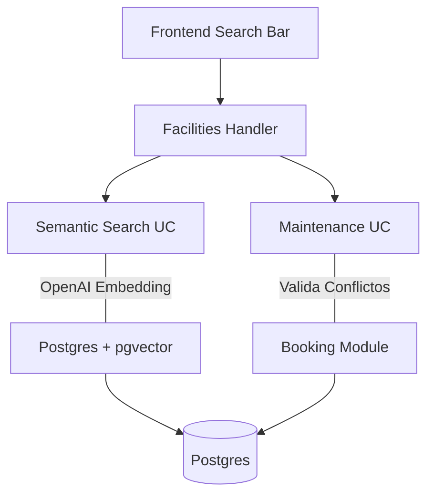

# 🏟️ Módulo Facilities

El módulo **Facilities** gestiona los activos físicos del club, desde el catálogo de canchas y piscinas hasta el equipamiento deportivo y las tareas de mantenimiento.

## 🚀 Responsabilidad

Este módulo es el núcleo de la infraestructura física:
- **Catálogo de Instalaciones:** Gestión de canchas, gimnasios, piscinas y campos con detalles técnicos (superficie, iluminación, techado).
- **Búsqueda Semántica (AI):** Motor de búsqueda basado en lenguaje natural (ej. "quiero jugar al tenis pero que no me dé el sol") utilizando **pgvector** y embeddings de OpenAI.
- **Gestión de Equipamiento:** Inventario de raquetas, pelotas, pecheras y préstamos asociados a las instalaciones.
- **Mantenimiento Preventivo:** Bloqueo de instalaciones para reparaciones o limpieza, integrándose con el motor de reservas para evitar conflictos.

## ⚙️ Arquitectura

Combina almacenamiento relacional con capacidades de inteligencia artificial:



## 🧠 Búsqueda Semántica
El sistema convierte las descripciones geográficas y técnicas de las instalaciones en vectores numéricos. Cuando un socio realiza una búsqueda textual:
1. El backend genera el embedding de la consulta.
2. Realiza una búsqueda de similitud coseno en la base de datos.
3. Devuelve los resultados ordenados por relevancia semántica.

## 💡 Snippets de Uso

### Búsqueda Semántica de Instalaciones
```go
// Busca instalaciones basándose en intención más que en palabras clave exactas
results, err := facilitiesUseCase.Search(clubID, "Cancha de tenis cubierta con luz", 5)
```

### Gestión de Mantenimiento
```go
// Verifica si hay una tarea de mantenimiento que impida una reserva
hasConflict, err := facilitiesRepo.HasConflict(clubID, facilityID, startTime, endTime)
```

## 🚥 Reglas de Negocio Críticas
1. **Conflicto de Mantenimiento:** Una instalación en estado `maintenance` no permite generar nuevas reservas en el módulo de Booking.
2. **Capacidad de Reservas:** Los horarios de apertura y cierre (`OpeningHour` / `ClosingHour`) definen la ventana operativa que el módulo de Booking debe respetar.

⚠️ **Nota de Infraestructura:** La búsqueda semántica requiere que la base de datos PostgreSQL tenga activada la extensión `vector`. El backend gestiona automáticamente la actualización de embeddings al modificar una instalación.
