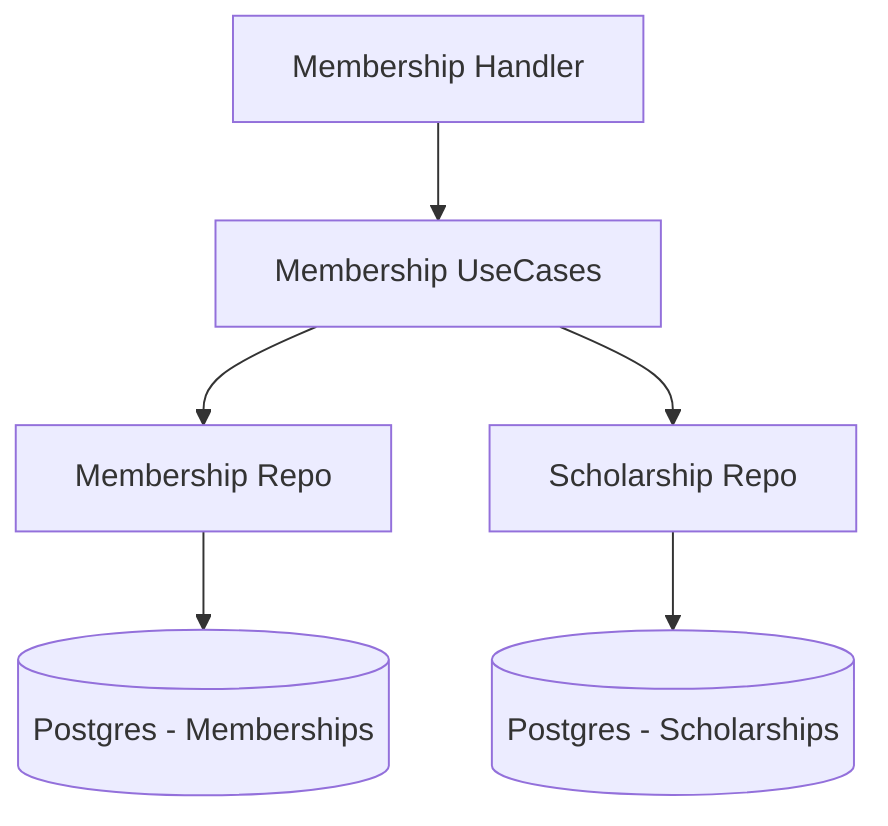

# 💳 Módulo Membership

El módulo **Membership** gestiona la relación a largo plazo entre el club y sus socios, administrando planes, facturación periódica y programas de beneficios o becas.

## 🚀 Responsabilidad

Este módulo es responsable de:
- **Planes de Membresía (Tiers):** Definición de categorías (ej. Oro, Plata, Socio Pleno) con sus respectivos beneficios y costos mensuales.
- **Ciclos de Facturación:** Soporte para suscripciones mensuales, trimestrales, semestrales y anuales.
- **Gestión de Becas (Scholarships):** Aplicación de descuentos porcentuales sobre la cuota social basados en mérito o necesidad.
- **Motor de Facturación:** Procesamiento automático de cargos recurrentes y gestión de saldos adeudados (`Outstanding Balance`).
- **Control de Mora:** Cálculo de recargos por falta de pago y actualización de estados del socio.

## ⚙️ Arquitectura

El módulo utiliza una estructura de repositorios desacoplados para manejar la complejidad de la facturación masiva:



## 💡 Snippets de Uso

### Crear una membresía para un usuario
```go
req := application.CreateMembershipRequest{
    UserID:           uuid.MustParse("user-id"),
    MembershipTierID: uuid.MustParse("tier-id"),
    BillingCycle:     domain.BillingCycleMonthly,
}

membership, err := membershipUseCase.CreateMembership(ctx, clubID, req)
```

### Ejecutar proceso de facturación mensual
Este proceso identifica a todos los socios cuya `NextBillingDate` ha vencido y actualiza sus saldos aplicando becas vigentes.

```go
processedCount, err := membershipUseCase.ProcessMonthlyBilling(ctx, clubID)
// processedCount indica cuántos socios fueron facturados exitosamente.
```

## ⚠️ Lógica de Negocio Crítica
1. **Becas:** Las becas se aplican dinámicamente durante el ciclo de facturación. Si un usuario tiene una beca del 50%, solo se le cargará la mitad del `MonthlyFee` de su plan.
2. **Robustez de Fechas:** El sistema maneja correctamente los desbordamientos de meses (ej. si una membresía inicia el 31 de enero, su próximo cobro será el 28 o 29 de febrero).
3. **Saldos:** El sistema no procesa pagos directamente; actualiza un `outstanding_balance` que luego es saldado a través del módulo de **Payment**.

⚠️ **Nota de Deuda Técnica:** El método `ProcessMonthlyBilling` procesa a todos los socios billables en un solo lote. Para clubes con decenas de miles de socios, se recomienda implementar paginación en la lectura y procesamiento por trabajadores (Workers) para evitar bloqueos prolongados en la base de datos.
