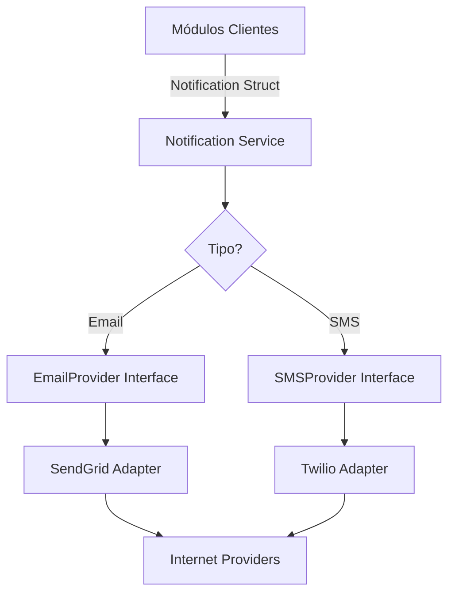

# 🔔 Módulo Notification

El módulo **Notification** es un servicio transversal que proporciona una infraestructura unificada para el envío de comunicaciones a los socios a través de diversos canales.

## 🚀 Responsabilidad

Este módulo abstrae la complejidad de los proveedores externos:
- **Envío Multi-canal:** Soporta Email, SMS y (en el futuro) Notificaciones Push.
- **Abstracción de Proveedores:** Implementa el patrón Provider para permitir el intercambio de servicios (ej. pasar de SendGrid a AWS SES) sin tocar la lógica de negocio.
- **Mocks Integrados:** Provee fallbacks por consola y mocks para entornos de desarrollo y testing, evitando envíos reales accidentales.

## ⚙️ Arquitectura

Utiliza puertos e interfaces para desacoplarse de las herramientas externas:



## 💡 Snippets de Uso

### Enviar un Email sencillo
```go
n := notification.Notification{
    RecipientID: "socio@email.com",
    Type:        notification.NotificationTypeEmail,
    Subject:     "Tu reserva ha sido confirmada",
    Message:     "Hola! Te confirmamos tu reserva de la Cancha 1...",
}

err := notificationService.Send(ctx, n)
```

## 🔌 Proveedores Soportados
- **Email:** SendGrid (Implementado en `infrastructure/providers/sendgrid.go`).
- **SMS:** Twilio (Implementado en `infrastructure/providers/twilio.go`).
- **Desarrollo:** Console Logging (Cae por defecto si no hay proveedores configurados).

## 🚥 Reglas de Negocio Críticas
1. **Fallbacks:** El sistema está diseñado para que, si un proveedor no está configurado (variables de entorno ausentes), no rompa el flujo de la aplicación, sino que registre el mensaje en los logs para depuración.
2. **Contexto:** Todas las llamadas de envío aceptan un `context.Context`, permitiendo la cancelación por timeout en envíos masivos.

⚠️ **Nota de Deuda Técnica:** Actualmente no existe una base de datos para persistir el historial de notificaciones enviadas. Se recomienda crear una tabla `notifications` para que los socios puedan ver su historial de comunicaciones dentro de la App.
