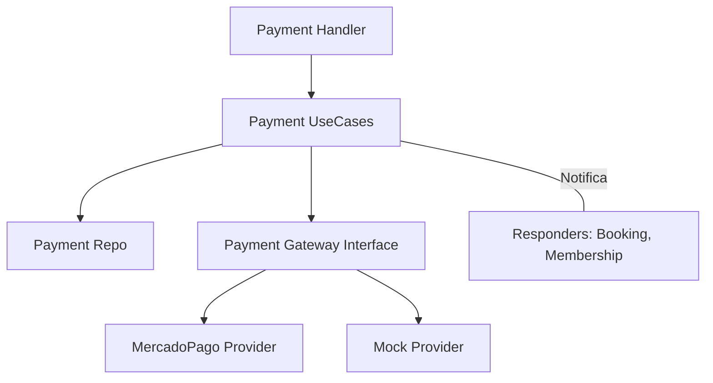

# 💰 Módulo Payment

El módulo **Payment** es el motor financiero del sistema, encargada de la integración con pasarelas de pago y la conciliación de saldos por servicios (reservas, membresías, etc.).

## 🚀 Responsabilidad

Este módulo gestiona la recaudación de ingresos a través de:
- **Pagos Online:** Integración con **MercadoPago** para procesamiento de tarjetas y métodos digitales.
- **Pagos Offline:** Registro administrativo de pagos en efectivo (`CASH`), transferencias (`TRANSFER`) o "Canje por Trabajo" (`LABOR_EXCHANGE`).
- **Webhooks:** Validación y procesamiento de notificaciones asíncronas de pasarelas de pago para confirmar transacciones.
- **Sistema de Responders:** Notificación automática a otros módulos cuando un pago es completado (ej. confirmar una reserva o saldar una membresía).

## ⚙️ Arquitectura

Diseñado bajo el patrón Gateway para permitir la expansión a otras pasarelas (ej. Stripe) sin afectar la lógica de negocio.



## 🔑 Variables de Entorno

El módulo requiere las credenciales de MercadoPago:

| Variable | Descripción | Obligatorio |
| :--- | :--- | :--- |
| `MP_ACCESS_TOKEN` | Token de acceso de MercadoPago (Producción o Prueba). | Sí (para pagos online) |
| `MP_WEBHOOK_SECRET` | Secreto para validar autenticidad de notificaciones. | Sí (seguridad webhooks) |

## 💡 Snippets de Uso

### Iniciar un Checkout
```go
req := application.CheckoutRequest{
    Amount:        1500.00,
    Description:   "Reserva de Cancha 1",
    PayerEmail:    "socio@email.com",
    ReferenceID:   bookingID,
    ReferenceType: "BOOKING",
    UserID:        userID,
    ClubID:        clubID,
}

checkoutURL, err := paymentUseCase.Checkout(ctx, req)
// Redirigir al usuario a checkoutURL
```

### Integración con otros módulos (Responders)
Para que un módulo reaccione a un pago, debe implementar `PaymentStatusResponder`:

```go
type MyModule struct {}

func (m *MyModule) OnPaymentStatusChanged(ctx context.Context, clubID string, refID uuid.UUID, status domain.PaymentStatus) error {
    if status == domain.PaymentStatusCompleted {
        // Ejecutar lógica de confirmación
    }
    return nil
}

// Registro en bootstrap:
paymentUseCase.RegisterResponder("MY_REFERENCE_TYPE", myModuleInstance)
```

## ⚠️ Seguridad y Validaciones
1. **Validación de Webhooks:** El sistema valida la firma de MercadoPago antes de procesar cualquier notificación externa para evitar fraude.
2. **Aislamiento Multi-tenant:** Cada pago está estrictamente ligado a un `ClubID`.
3. **Idempotencia:** El procesamiento de webhooks está diseñado para ser seguro ante reintentos de la pasarela.

⚠️ **Propuesta de Mejora (Deuda Técnica):** La captura de errores en los `Responders` es básica. Se recomienda implementar una cola de mensajes (Message Queue) para asegurar que la confirmación de una reserva o membresía nunca falle debido a una caída temporal de otro servicio durante el procesamiento del webhook.
