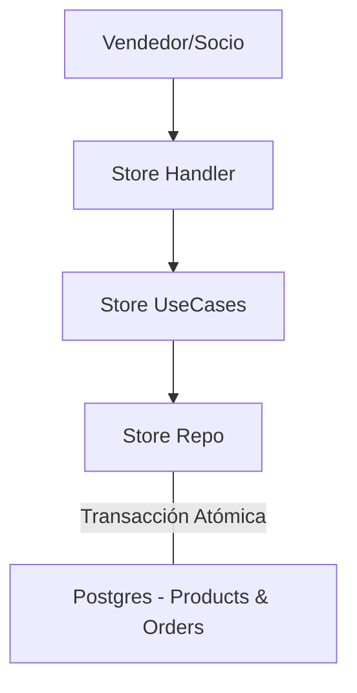

# 🛒 Módulo Store

El módulo **Store** gestiona la venta de productos físicos dentro de la institución, cubriendo desde el merchandising y equipamiento hasta los artículos del buffet.

## 🚀 Responsabilidad

Este módulo permite:
- **Gestión de Inventario (Stock):** Controlar la disponibilidad de productos por club.
- **Categorización:** Clasificación de ítems en grupos (ej. "Merchandising", "Buffet", "Equipamiento").
- **Procesamiento de Órdenes:** Registro de ventas tanto para socios identificados como para invitados.
- **Transacciones Atómicas:** Garantiza que el stock se reduzca solo si la orden se crea correctamente (integración de base de datos).

## ⚙️ Arquitectura

Maneja ventas rápidas en el punto de venta (POS) del club:



- **Decrecimiento de Stock:** El repositorio implementa `CreateOrderWithStockUpdate`, que utiliza una transacción de base de datos para asegurar la consistencia entre la orden generada y el remanente en depósito.

## 💡 Snippets de Uso

### Crear un Producto con Stock Inicial
```go
product := &domain.Product{
    Name:          "Remera Oficial 2024",
    Price:         15000.00,
    StockQuantity: 50,
    Category:      "Merchandising",
    IsActive:      true,
}
err := storeUseCase.CreateProduct(clubID, product)
```

### Procesar una Venta (Checkout)
```go
items := []domain.OrderItem{
    {ProductID: remeraUUID, Quantity: 1, UnitPrice: 15000.00},
}
order, err := storeUseCase.Checkout(clubID, &userID, items)
```

## 🚥 Reglas de Negocio Críticas
1. **Validación de Inventario:** El sistema impide completar una orden si la cantidad solicitada supera el `StockQuantity` actual (retorna error de stock insuficiente).
2. **Multitenancy:** Los productos y sus SKU son específicos de cada club.
3. **Persistencia de Precios:** La orden guarda el `UnitPrice` al momento de la compra para evitar inconsistencias históricas si el producto cambia de precio en el futuro.

⚠️ **Nota de Deuda Técnica:** Actualmente, el módulo de Store y el de Payments están desacoplados. Las órdenes en Store se marcan como `PAID` por defecto asumiendo cobro en efectivo. Se recomienda integrar con el módulo de **Payment** para permitir pagos digitales en la tienda.
