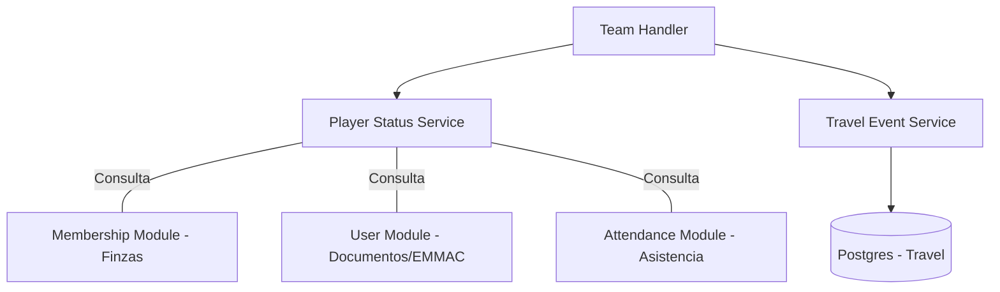

# ⚽ Módulo Team

El módulo **Team** se enfoca en la gestión operativa de los equipos del club y el seguimiento individualizado del estado de cada deportista.

## 🚀 Responsabilidad

Este módulo es responsable de:
- **Semáforo del Jugador (Player Status):** Un motor de reglas que consolida información financiera, médica y de asistencia para determinar si un jugador está habilitado para competir.
- **Gestión de Viajes (Travel Events):** Logística de traslados, alojamiento e itinerarios para equipos que compiten fuera de la sede.
- **Convocatorias y Disponibilidad:** Envío de convocatorias para partidos y gestión de la respuesta de disponibilidad de los jugadores (`CONFIRMED`, `DECLINED`, `MAYBE`).
- **Entrenamientos:** Definición de grupos de entrenamiento y seguimiento de asistencia.

## ⚙️ Arquitectura

Este módulo actúa como un integrador, orquestando datos de múltiples dominios para ofrecer una vista unificada:



## 🚥 El Semáforo del Jugador (Business Rules)

El estado `IsInhabilitado` se calcula bajo los siguientes criterios:
1. **Financiero:** Si el socio tiene un `OutstandingBalance > 0` en el módulo de Membership, se marca como `DEBTOR`.
2. **Médico:** Si el usuario no tiene un documento tipo `EMMAC` validado o si el mismo está vencido.
3. **Asistencia:** Aunque no inhabilita automáticamente, se calcula una tasa de asistencia para que el entrenador tome decisiones informadas.

## 💡 Snippets de Uso

### Obtener el estado unificado de un jugador
```go
status, err := playerStatusService.GetPlayerStatus(ctx, clubID, userID)
if status.IsInhabilitado {
    fmt.Println("El jugador no puede jugar. Razones:", status.FinancialStatus, status.MedicalStatus)
}
```

### Gestión de Disponibilidad para un Partido
```go
availability := &domain.PlayerAvailability{
    MatchEventID: matchUUID,
    UserID:       userID,
    Status:       domain.AvailabilityConfirmed,
    Reason:       "Disponible para viajar",
}

err := teamUseCase.SetPlayerAvailability(availability)
```

## ⚠️ Reglas de Negocio Críticas
1. **EMMAC:** La validación médica es estricta; sin un apto médico vigente, el sistema marcará al jugador como inhabilitado de forma preventiva.
2. **Deuda:** Un jugador con deuda social (cuota pendiente) es bloqueado para convocatorias hasta que el módulo de **Payment** confirme la regularización.

⚠️ **Nota de Deuda Técnica:** El cálculo de la tasa de asistencia (`calculateAttendanceRate`) es actualmente un placeholder. Debe implementarse la agregación real de registros del módulo de **Attendance** una vez que dicho módulo tenga datos históricos suficientes.
