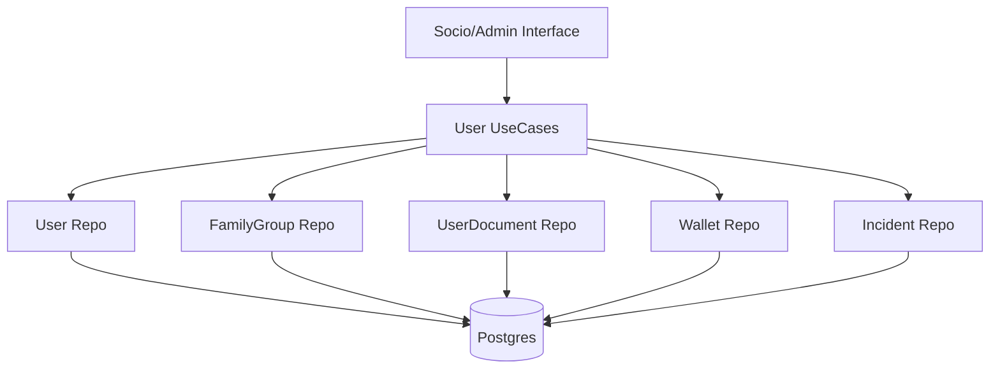

# 👤 Módulo User

El módulo **User** es el repositorio central de identidad y datos de los socios, gestionando perfiles, relaciones familiares, documentación crítica y billetera virtual.

## 🚀 Responsabilidad

Este módulo orquesta:
- **Gestión de Perfiles:** Información personal, preferencias deportivas y roles (`MEMBER`, `COACH`, `ADMIN`, `SUPER_ADMIN`).
- **Grupos Familiares:** Vinculación de socios bajo un "Jefe de Familia" para facilitar el pago unificado de cuotas.
- **Documentación de Salud (EMMAC):** Seguimiento del estado de los certificados médicos y detección automática de vencimientos.
- **Billetera Virtual (Wallet):** Saldo para compras internas y pagos rápidos.
- **Estadísticas (Stats):** Seguimiento de la actividad del socio (XP, participaciones en eventos).
- **Incidentes:** Registro de sucesos o lesiones dentro del club para trazabilidad de seguros.

## ⚙️ Arquitectura

Actúa como proveedor de datos fundamental para casi todos los demás módulos:



- **Cálculo de Categoría:** El dominio incluye una función `CalculateCategory()` que deriva la categoría deportiva del socio basándose puramente en su año de nacimiento (clave para el módulo de `Attendance` y `Disciplines`).

## 💡 Snippets de Uso

### Crear un Grupo Familiar
```go
// Crea el grupo y asigna al usuario como cabeza de familia
group, err := userUseCase.CreateFamilyGroup(clubID, "Los Pérez", headUserUUID)
```

### Gestión de Documentos Médicos
```go
// El estado se actualiza a 'VALID' tras la revisión administrativa del PDF cargado
err := userUseCase.ValidateHealthCertificate(clubID, userID, expiryDate)
```

## 🚥 Reglas de Negocio Críticas
1. **Validación de Identidad:** Todas las consultas externas pasan el `ClubID` para asegurar que un administrador no pueda ver o editar socios de otra institución.
2. **Jerarquía Familiar:** Un socio solo puede pertenecer a un `FamilyGroup` a la vez.
3. **Control de Salud:** El campo `MedicalCertStatus` es consultado por el módulo de **Booking** antes de permitir cualquier reserva.

⚠️ **Nota de Deuda Técnica:** La lógica de vencimiento de documentos se gestiona mediante un Job periódico (`jobs/document_expiration_job.go`). Se recomienda mejorar la observabilidad de este job para asegurar que las notificaciones de vencimiento se disparen a tiempo.
