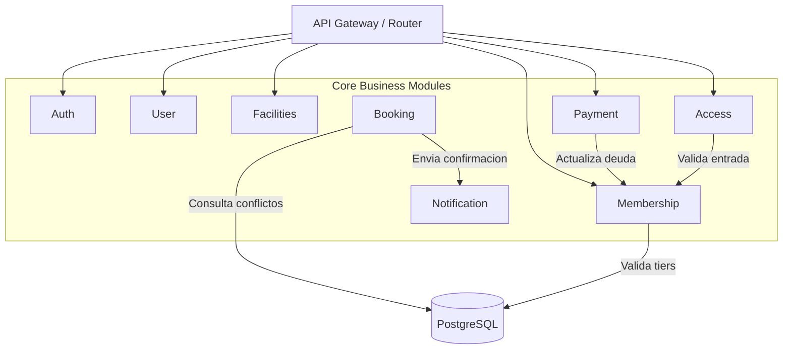

# Arquitectura del Sistema

## Visión General
**Club Pulse System** sigue un patrón de **Monolito Modular**. Esto significa que el sistema está desplegado como una sola unidad (un binario) para simplificar la infraestructura y reducir costos (ideal para MVP), pero el código está estructurado internamente en **Módulos** estrictamente separados que se comunican a través de interfaces bien definidas.

Esto nos permite migrar fácilmente a Microservicios en el futuro si la escala lo requiere, simplemente extrayendo un módulo a su propio servicio.

## Estructura de Directorios (Clean Architecture)

Dentro de cada módulo (`backend/internal/modules/`), seguimos los principios de Clean Architecture:

```
module/
├── domain/           # Entidades, Enums e Interfaces del Repositorio (Sin dependencias externas)
├── application/      # Casos de Uso (Lógica de Negocio)
├── infrastructure/   # Implementaciones (HTTP Handlers, Postgres Repositories)
└── module.go         # Wire up / Inyección de Dependencias del módulo
```

### Capas

1.  **Domain (Dominio)**:
    - Es el núcleo. Contiene la lógica empresarial pura y las estructuras de datos (ej. `User`, `Booking`).
    - Define interfaces (ej. `BookingRepository`) pero no cómo se implementan.

2.  **Application (Aplicación)**:
    - Contiene los "Casos de Uso" que orquestan las operaciones (ej. `CreateBooking`, `Login`).
    - Utiliza las interfaces del Dominio.

3.  **Infrastructure (Infraestructura)**:
    - Detalles técnicos. Aquí va el código que habla con la Base de Datos (GORM), los Controladores HTTP (Gin), o APIs externas.
    - Implementa las interfaces definidas en Dominio.

## Diagrama de Módulos



## Decisiones Técnicas Clave
- **Go Interaction**: Los módulos no se importan entre sí directamente en la capa de infraestructura para evitar acoplamiento. La comunicación ideal es por eventos o interfaces compartidas en el `platform` layer.
- **Base de Datos**: Compartimos una instancia de PostgreSQL, pero lógicamente cada módulo es dueño de sus tablas.
