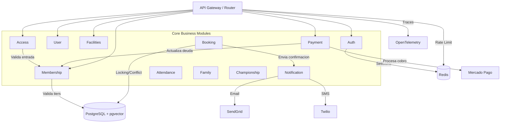

# Arquitectura del Sistema

## Visión General y Modelo Multi-Tenant

**Club Pulse System** está diseñado como un sistema **Multi-Tenant**, donde cada club deportivo opera como un "inquilino" (tenant) independiente en una única instancia de la aplicación. Esto permite que múltiples clubes usen el sistema de forma segura y aislada, sin que los datos de un club sean visibles para otro.

-   **Aislamiento de Datos:** La clave para el aislamiento es el `club_id`. Casi todas las tablas en la base de datos tienen una columna `club_id`. El aislamiento se garantiza mediante:
    1.  **Context Injection:** El `TenantMiddleware` extrae el `club_id` y lo inyecta en el `context.Context` de Go.
    2.  **Repository Enforcement:** Los métodos de los repositorios aceptan explícitamente el `club_id` y lo utilizan en las cláusulas `WHERE` de todas las consultas GORM, evitando fugas de datos accidentales.
-   **Identificación del Tenant:** El sistema identifica al tenant actual a través de un header o el `slug` del club en la URL. El middleware resuelve el ID interno y lo propaga hacia las capas inferiores.

El sistema sigue un patrón de **Monolito Modular**. Está estructurado en **Módulos** independientes que se comunican a través de interfaces, facilitando el mantenimiento y la escalabilidad.

## Estructura de Directorios (Clean Architecture)

Dentro de cada módulo (`backend/internal/modules/`), seguimos los principios de Clean Architecture:

```
module/
├── domain/           # Entidades, Enums e Interfaces del Repositorio (Sin dependencias externas)
├── application/      # Casos de Uso (Lógica de Negocio)
├── infrastructure/   # Implementaciones (HTTP Handlers, Postgres Repositories)
└── module.go         # Wire up / Inyección de Dependencias del módulo
```

### Capas

1.  **Domain (Dominio)**:
    - Es el núcleo. Contiene la lógica empresarial pura y las estructuras de datos (ej. `User`, `Booking`).
    - Define interfaces (ej. `BookingRepository`) pero no cómo se implementan.

2.  **Application (Aplicación)**:
    - Contiene los "Casos de Uso" que orquestan las operaciones (ej. `CreateBooking`, `Login`).
    - Utiliza las interfaces del Dominio.

3.  **Infrastructure (Infraestructura)**:
    - Detalles técnicos. Aquí va el código que habla con la Base de Datos (GORM), los Controladores HTTP (Gin), o APIs externas.
    - Implementa las interfaces definidas en Dominio.

## Diagrama de Módulos



## Nuevas Capacidades Tecnológicas (Fase 2-6)
1.  **Seguridad Avanzada**:
    -   **HttpOnly & Secure Cookies**: Autenticación robusta eliminando el uso de `localStorage` para tokens JWT, protegiendo contra ataques XSS.
    -   **Multi-tenant Isolation**: Validación estricta de `club_id` requerida en las firmas de los métodos de repositorio.
2.  **Observabilidad**:
    -   **OpenTelemetry**: Trazabilidad distribuida para detectar cuellos de botella.
    -   **Logs Estructurados**: Formato JSON compatible con sistemas de análisis.
3.  **Performance & Scaling**:
    -   **Redis**: Gestión de sesiones, Rate Limiting y Caching de disponibilidad.
    -   **Vector Search**: Búsqueda semántica de instalaciones usando `pgvector`.
    -   **Health Checks**: Endpoints para orquestación en produccion (`/healthz`).
4.  **Gestión Administrativa**:
    -   **Visual Scheduler**: Grid interactivo para gestión de ocupación.
    -   **Admin API**: Endpoints agregados para reportes de ocupación y revenue.


## Integraciones Externas (Infrastructure Adapters)
El sistema utiliza adaptadores en la capa de infraestructura para comunicarse con servicios de terceros:
- **Pagos**: `MercadoPagoGateway` implementa la interfaz `PaymentGateway`. Encapsula la SDK de MP.
- **Notificaciones**: 
  - `SendGridProvider` (Email)
  - `TwilioProvider` (SMS)
  - Ambos implementan interfaces genéricas (`EmailProvider`, `SMSProvider`) permitiendo switch a Mock o Consola según configuración.
- **Auth**: Google OAuth 2.0 para login social.

## Decisiones Técnicas Clave
- **Go Interaction**: Los módulos no se importan entre sí directamente en la capa de infraestructura para evitar acoplamiento. La comunicación ideal es por eventos o interfaces compartidas en el `platform` layer.
- **Base de Datos**: Compartimos una instancia de PostgreSQL, pero lógicamente cada módulo es dueño de sus tablas.
