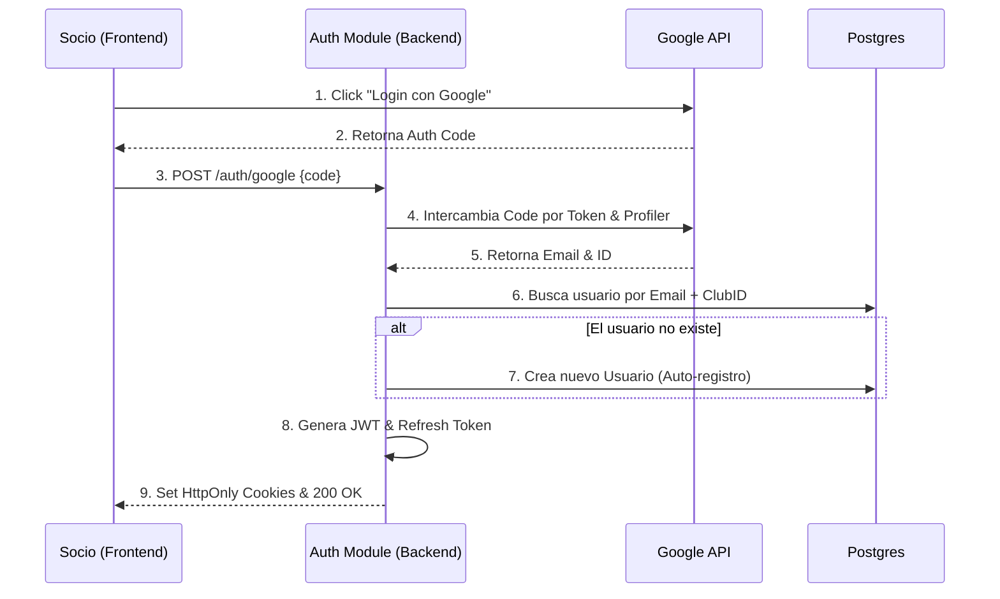
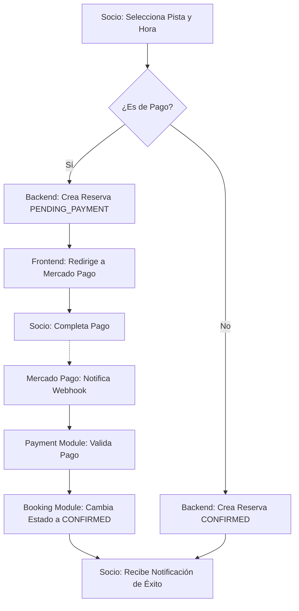
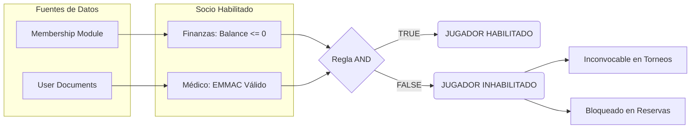

# 🏗️ Diagramas de Arquitectura

Este documento visualiza los flujos de datos y lógica de negocio más críticos del sistema **Club Pulse**.

---

## 1. Registro y Login con Google
Este flujo describe la integración con Google OAuth2 y la creación automática de usuarios asociados a un club.

---

## 2. Ciclo de Vida de una Reserva
Flujo simplificado de una reserva desde la selección hasta la confirmación de pago por Webhook.

---

## 3. El Semáforo del Jugador
Visualización de cómo el `TeamModule` orquesta datos de otros módulos para habilitar a un jugador.

---
⚠️ *Estos diagramas representan la lógica implementada hasta la fecha. Para detalles de implementación técnica, consulte los README.md de cada módulo.*
