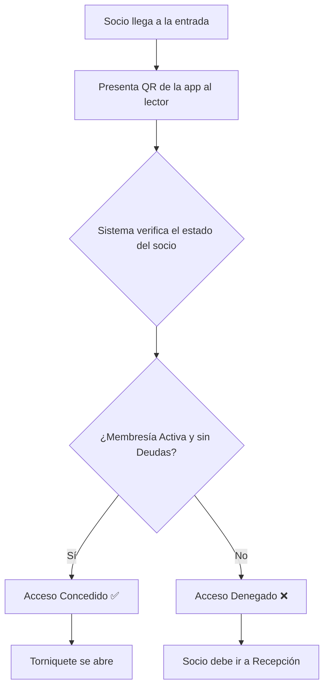

# Manual de Usuario: Módulo de Control de Acceso (Access)

## 1. Propósito

Este módulo gestiona la entrada y salida física de las instalaciones del club. Funciona como un guardia digital que se asegura de que solo los socios autorizados puedan ingresar.

## 2. Roles Implicados

-   **Socio (`MEMBER`):** Utiliza el sistema para ingresar al club.
-   **Administrador (`ADMIN`):** Supervisa los registros de acceso.

---

## 3. Guía para Socios (Rol: `MEMBER`)

### 🔹 Cómo Ingresar al Club

**Paso a paso:**
1.  **Abre la aplicación del club** en tu teléfono móvil y navega a la sección "Mi QR" o "Acceso".
2.  Se mostrará un **código QR único** que te identifica como socio.
3.  **Acerca tu teléfono al lector QR** ubicado en los torniquetes o en la entrada del club.
4.  **El sistema verificará tu identidad** y el estado de tu membresía en tiempo real.
5.  **Si todo está en orden** (membresía activa, sin deudas), el acceso se concederá y el torniquete se abrirá.
6.  **Si hay un problema**, el acceso será denegado y se mostrará un mensaje (ej: "Membresía Vencida"). En ese caso, deberás acercarte a recepción.

---

## 4. Guía para Administradores (Rol: `ADMIN`)

### 🔸 Cómo Ver los Registros de Acceso

Puedes consultar un historial de todas las entradas y salidas para auditoría y seguridad.

**Paso a paso:**
1.  **Accede al Panel de Administración.**
2.  Navega a la sección de **"Control de Acceso"** o **"Registros de Entrada"**.
3.  Verás una **lista en tiempo real** de todos los eventos de acceso.
4.  Cada registro incluirá:
    -   Nombre del socio.
    -   Fecha y hora.
    -   Resultado (`CONCEDIDO` o `DENEGADO`).
    -   Motivo del rechazo (si aplica).
5.  Puedes **filtrar los registros** por fecha o por socio para encontrar un evento específico.

---

## 5. Diagrama de Flujo: Proceso de Acceso (Socio)

