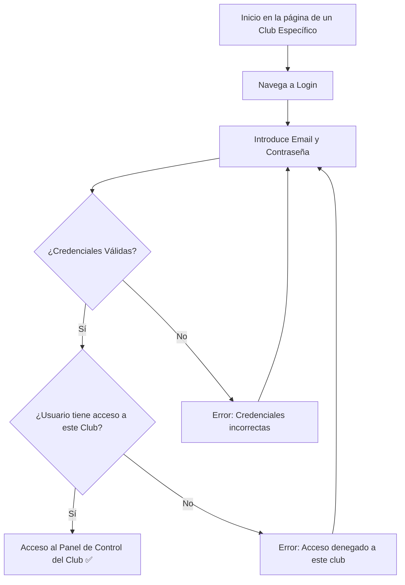

# Manual de Usuario: Módulo de Autenticación (Auth)

## 1. Propósito y Contexto de Club

Este módulo gestiona tu acceso a la plataforma. Se encarga de la creación de cuentas, el inicio de sesión y la seguridad.

Es fundamental entender que el sistema es **multi-club (multi-tenant)**. Esto significa que tu cuenta de usuario es global, pero tu acceso y tus roles son **específicos para cada club**. Por ejemplo, puedes ser `ADMIN` en un club y `MEMBER` en otro con el mismo correo y contraseña.

El inicio de sesión siempre se realiza en el contexto de un club específico, generalmente determinado por la URL que estás visitando (ej: `mi-club.com` o `plataforma.com/mi-club`).

## 2. Roles Implicados

-   Todos los usuarios que interactúan con la plataforma.

---

## 3. Guía de Usuario

### 🔹 Cómo Registrar una Cuenta Nueva

Si es tu primera vez en la plataforma, necesitarás crear una cuenta.

**Paso a paso:**
1.  Desde la página de inicio del club al que quieres unirte, haz clic en **"Registrarse"**.
2.  Serás dirigido a un formulario de registro.
3.  Completa los campos requeridos:
    -   **Nombre Completo**
    -   **Correo Electrónico** (Este será tu nombre de usuario global)
    -   **Contraseña** (Elige una contraseña segura)
4.  Al crear la cuenta, quedarás asociado al club desde donde te registraste, usualmente con el rol de `MEMBER`.

### 🔹 Cómo Iniciar Sesión

**Paso a paso:**
1.  Navega a la página de **"Iniciar Sesión"** del club específico.
2.  Introduce tu **Correo Electrónico** y **Contraseña**.
3.  Haz clic en **"Iniciar Sesión"**.
4.  Si las credenciales son correctas, accederás al panel de control de **ese club en particular**. Si tienes acceso a otros clubes, podrás cambiar de contexto desde tu panel de usuario.

### 🔹 Cómo Cerrar Sesión

**Paso a paso:**
1.  Busca el **ícono de tu perfil** o tu nombre.
2.  Haz clic para desplegar el menú.
3.  Selecciona **"Cerrar Sesión"**. Esto cerrará tu sesión en todos los clubes.

### 🔹 Cómo Restablecer tu Contraseña

Si has olvidado tu contraseña, el proceso es global.

**Paso a paso:**
1.  En cualquier página de "Iniciar Sesión", haz clic en **"¿Olvidaste tu contraseña?"**.
2.  Introduce tu dirección de correo electrónico.
3.  Recibirás un correo con instrucciones para crear una nueva contraseña, que será válida para todos los clubes a los que tengas acceso.

---

## 4. Diagrama de Flujo del Proceso de Inicio de Sesión

