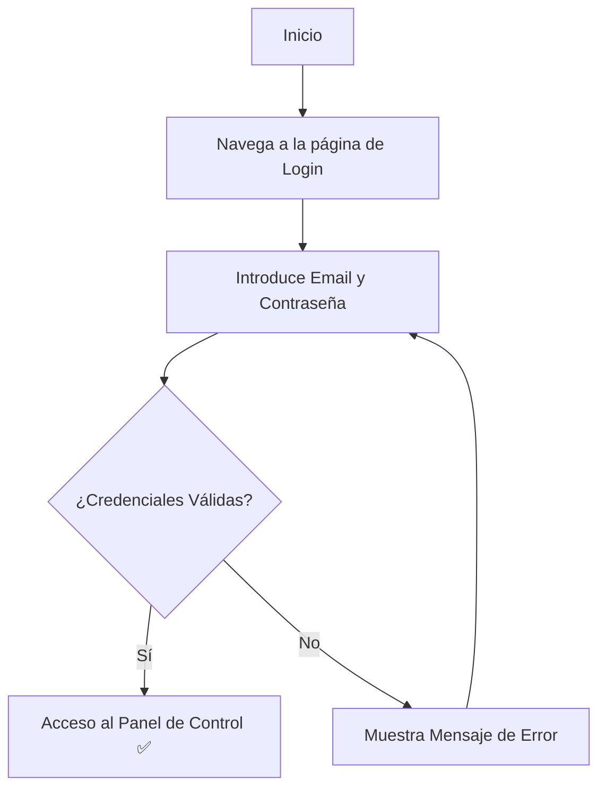

# Manual de Usuario: Módulo de Autenticación (Auth)

## 1. Propósito

Este módulo gestiona tu acceso a la plataforma. Se encarga de la creación de cuentas, el inicio de sesión y la seguridad para asegurar que tu información esté protegida.

## 2. Roles Implicados

-   Todos los usuarios que interactúan con la plataforma.

---

## 3. Guía de Usuario

### 🔹 Cómo Registrar una Cuenta Nueva

Si es tu primera vez en la plataforma, necesitarás crear una cuenta.

**Paso a paso:**
1.  Desde la página de inicio, haz clic en el botón **"Registrarse"**.
2.  Serás dirigido a un formulario de registro.
3.  Completa los campos requeridos:
    -   **Nombre Completo**
    -   **Correo Electrónico** (Este será tu nombre de usuario)
    -   **Contraseña** (Elige una contraseña segura)
4.  Haz clic en el botón **"Crear Cuenta"**.
5.  Si todo es correcto, tu cuenta será creada y serás redirigido a la página de inicio de sesión o directamente a tu panel de control.

### 🔹 Cómo Iniciar Sesión

Una vez que tienes una cuenta, puedes acceder a la plataforma.

**Paso a paso:**
1.  Navega a la página de **"Iniciar Sesión"**.
2.  Introduce tu **Correo Electrónico** y **Contraseña** en los campos correspondientes.
3.  Haz clic en el botón **"Iniciar Sesión"**.
4.  Si las credenciales son correctas, accederás a tu panel de control personalizado.

### 🔹 Cómo Cerrar Sesión

Es importante cerrar sesión si estás en un ordenador compartido.

**Paso a paso:**
1.  Busca el **ícono de tu perfil** o tu nombre, generalmente ubicado en la esquina superior derecha de la pantalla.
2.  Haz clic sobre él para desplegar un menú.
3.  Selecciona la opción **"Cerrar Sesión"**.
4.  Serás redirigido de forma segura a la página de inicio.

### 🔹 Cómo Restablecer tu Contraseña

Si has olvidado tu contraseña, puedes recuperarla de forma segura.

**Paso a paso:**
1.  En la página de "Iniciar Sesión", haz clic en el enlace **"¿Olvidaste tu contraseña?"**.
2.  Introduce la dirección de correo electrónico con la que te registraste.
3.  Recibirás un correo electrónico con un enlace e instrucciones para crear una nueva contraseña.

---

## 4. Diagrama de Flujo del Proceso de Inicio de Sesión

