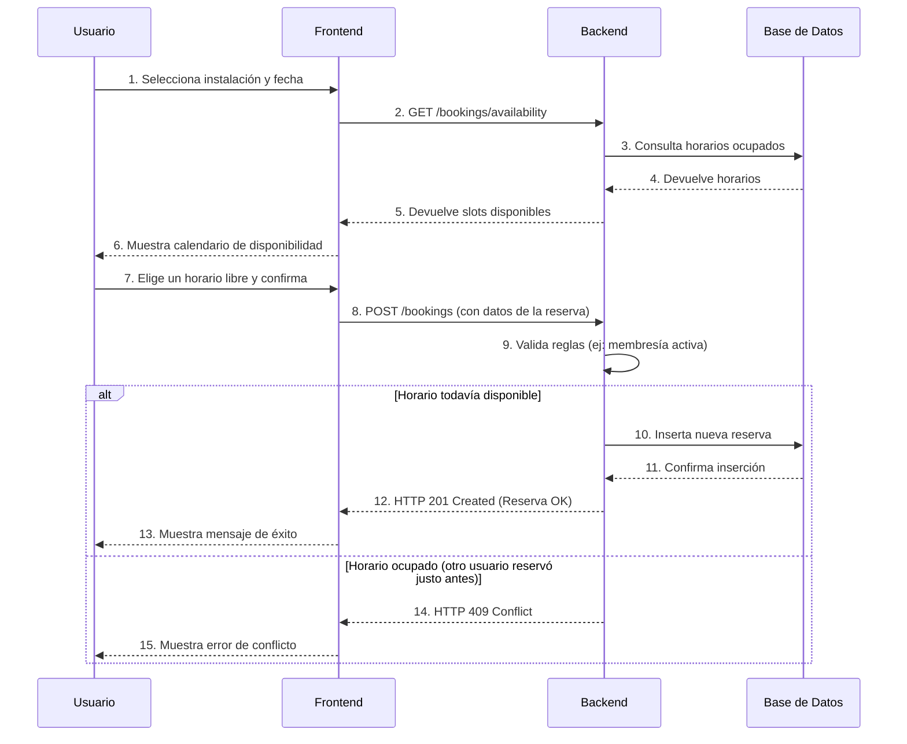

# Módulo de Reservas (Booking)

Este módulo permite a los socios reservar instalaciones y gestiona todo el ciclo de vida de una reserva, desde su creación hasta su cancelación. Se integra directamente con el [Módulo de Instalaciones](../facilities/README.md) para consultar la disponibilidad en tiempo real.

## Casos de Uso para Socios (Members)

### 1. Consultar Disponibilidad de una Instalación

Antes de reservar, un socio puede verificar qué horarios están libres para una instalación en una fecha específica.

-   **Flujo**:
    1.  El usuario selecciona una instalación (ej: "Cancha de Pádel 1") y una fecha.
    2.  El sistema muestra un calendario o una lista de franjas horarias, indicando cuáles están disponibles y cuáles están ya reservadas.
-   **Endpoint relacionado**: `GET /bookings/availability`

### 2. Crear una Reserva

Un socio puede reservar una franja horaria disponible para una instalación.

-   **Flujo**:
    1.  Después de encontrar un horario libre, el usuario selecciona la hora de inicio y fin.
    2.  El sistema crea la reserva a nombre del usuario. Si la instalación tiene un costo, se podría generar un cargo en la billetera del socio (ver [Módulo de Pagos](../payment/README.md)).
    3.  Si el horario solicitado acaba de ser ocupado por otro usuario, el sistema devolverá un error de conflicto para evitar reservas duplicadas.
-   **Endpoint relacionado**: `POST /bookings`

### 3. Ver Mis Reservas

Los socios pueden consultar un listado de todas las reservas que han realizado (tanto futuras como pasadas).

-   **Flujo**:
    1.  El usuario accede a la sección "Mis Reservas" de su perfil.
    2.  El sistema muestra una lista de sus reservas, incluyendo detalles como la instalación, fecha, hora y estado (ej: "Confirmada", "Cancelada").
-   **Endpoint relacionado**: `GET /bookings`

### 4. Cancelar una Reserva

Si un socio ya no necesita una reserva, puede cancelarla, liberando el horario para otros.

-   **Flujo**:
    1.  El usuario busca la reserva que desea cancelar en su listado.
    2.  Al hacer clic en "Cancelar", el sistema cambia el estado de la reserva y libera el horario. Pueden aplicarse reglas de negocio (ej: no se puede cancelar con menos de 24 horas de antelación).
-   **Endpoint relacionado**: `DELETE /bookings/:id`

### 5. Apuntarse a la Lista de Espera (Waitlist)

Si un horario deseado ya está completo, los socios pueden apuntarse a una lista de espera.

-   **Flujo**:
    1.  Al ver un horario ocupado, el usuario tiene la opción de "Apuntarse a la lista de espera".
    2.  El sistema registra su interés para esa instalación y esa franja horaria.
    3.  Si otro usuario cancela su reserva y se libera un hueco, el sistema puede notificar automáticamente al primer usuario en la lista de espera para que tenga la oportunidad de reservar.
-   **Endpoint relacionado**: `POST /bookings/waitlist`

### Flujo Visual de una Reserva (Diagrama)

A continuación se muestra un diagrama de secuencia que ilustra el proceso de creación de una reserva exitosa.

## Casos de Uso para Administradores (Admins)

### 1. Ver Todas las Reservas del Club

Los administradores pueden supervisar toda la actividad de reservas del club.

-   **Flujo**:
    1.  El administrador accede al panel de gestión de reservas.
    2.  Puede ver una lista completa de todas las reservas del club y filtrarlas por instalación o por un rango de fechas para analizar la ocupación.
-   **Endpoint relacionado**: `GET /bookings/all`

### 2. Gestión de Reservas Recurrentes

Para actividades fijas (como clases o entrenamientos), los administradores pueden crear reglas de reserva que se repiten en el tiempo.

-   **Crear Regla de Reserva Recurrente**:
    -   **Flujo**: Un admin define una regla, por ejemplo: "Reservar la Cancha 3 para la clase de tenis todos los martes de 10:00 a 11:00".
    -   **Endpoint relacionado**: `POST /bookings/recurring`

-   **Generar Reservas a partir de Reglas**:
    -   **Flujo**: Periódicamente, un administrador (o un proceso automático) ejecuta una acción que lee estas reglas y crea las reservas concretas para las próximas semanas.
    -   **Endpoint relacionado**: `POST /bookings/generate`
