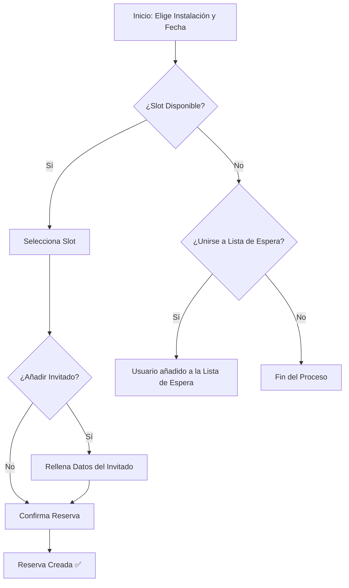

# Manual de Usuario: Módulo de Reservas

## 1. Propósito

Este módulo te permite encontrar horarios disponibles y reservar las instalaciones del club, como canchas de tenis o pádel, de una manera rápida y sencilla. También puedes gestionar tus reservas existentes y apuntarte a listas de espera.

## 2. Roles Implicados

-   **Socio (`MEMBER`):** Puede crear y gestionar sus propias reservas.
-   **Administrador (`ADMIN`):** Puede ver todas las reservas del club y gestionarlas.

---

## 3. Guía para Socios (Rol: `MEMBER`)

### 🔹 Cómo Reservar una Instalación

Esta guía te muestra cómo realizar una reserva desde el calendario de disponibilidad.

**Paso a paso:**
1.  **Navega a la sección "Reservar"** en la aplicación.
2.  **Selecciona la instalación** que deseas reservar (ej: "Cancha de Pádel 1").
3.  **Elige una fecha** usando el navegador de calendario. Se mostrarán los horarios del día.
4.  **Busca un horario disponible.** Los horarios libres se mostrarán claramente, mientras que los ocupados aparecerán deshabilitados.
5.  **Haz clic en el horario** que deseas. Se abrirá un modal o panel de confirmación.
6.  **(Opcional) Añade un invitado.** Si vas a jugar con alguien que no es socio, marca la casilla "Añadir Invitado" y completa sus datos. Ten en cuenta que esto puede tener un costo adicional.
7.  **Confirma la reserva.** Haz clic en el botón "Confirmar Reserva".
8.  **¡Listo!** Recibirás una confirmación y la reserva aparecerá en la sección "Mis Reservas".

### 🔹 Cómo Unirse a una Lista de Espera

Si el horario que quieres está ocupado, puedes pedir al sistema que te avise si se libera.

**Paso a paso:**
1.  Sigue los pasos 1-3 de la guía anterior para encontrar el horario que deseas.
2.  **Haz clic en el horario ocupado.**
3.  Aparecerá un botón o una opción que dice **"Unirse a la lista de espera"**. Haz clic en él.
4.  **Confirmación:** El sistema confirmará que te has unido a la lista.
5.  **Espera la notificación:** Si el usuario que tenía la reserva la cancela, el sistema te asignará automáticamente el turno y te enviará una notificación.

### 🔹 Cómo Ver y Cancelar tus Reservas

**Paso a paso:**
1.  **Navega a la sección "Mis Reservas"** en tu perfil o en el menú principal.
2.  Verás una lista con todas tus reservas futuras y pasadas.
3.  Busca la reserva que deseas cancelar y haz clic en el botón **"Cancelar"**.
4.  Confirma la cancelación en el aviso. La reserva se eliminará de tu lista y el horario quedará libre.

---

## 4. Guía para Administradores (Rol: `ADMIN`)

### 🔸 Cómo Ver Todas las Reservas del Club

Como administrador, tienes una vista global de la ocupación del club.

**Paso a paso:**
1.  **Navega al Panel de Administración.**
2.  Busca la sección o menú de **"Reservas"** o **"Calendario Maestro"**.
3.  Por defecto, verás todas las reservas del día.
4.  **Utiliza los filtros** en la parte superior de la página para buscar reservas por:
    -   Rango de fechas (`desde` / `hasta`).
    -   Instalación específica.
5.  El sistema mostrará una lista o una vista de calendario con todas las reservas que coinciden con tus filtros.

---

## 5. Diagrama de Flujo del Proceso de Reserva (Socio)

