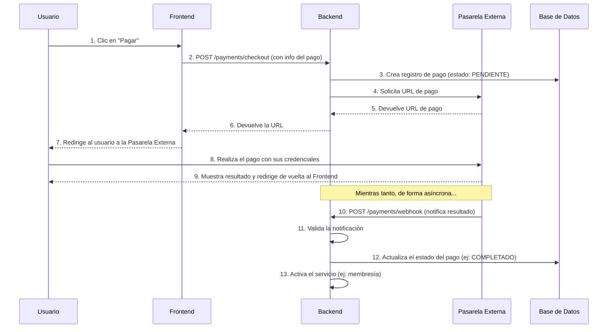

# Módulo de Pagos (Payment)

Este módulo gestiona todas las transacciones monetarias. En lugar de procesar los pagos directamente, actúa como un orquestador que se integra con una pasarela de pagos externa (como Mercado Pago) para garantizar transacciones seguras.

## Flujo General de un Pago

El proceso de pago está diseñado para ser seguro, delegando el manejo de datos sensibles (como tarjetas de crédito) a una pasarela especializada.

1.  **Iniciación**: El usuario decide realizar un pago (ej: pagar su [cuota de membresía](../membership/README.md)).
2.  **Redirección**: El sistema Club Pulse se comunica con la pasarela de pago y genera una URL de pago única. El usuario es redirigido a esta URL (fuera del sistema Club Pulse).
3.  **Transacción**: El usuario introduce sus datos de pago directamente en el entorno seguro de la pasarela.
4.  **Notificación**: Una vez que el pago es completado (o falla), la pasarela de pago notifica al sistema Club Pulse sobre el resultado.
5.  **Confirmación**: El sistema Club Pulse actualiza el estado del pago internamente (ej: marca una factura como "Pagada") y le otorga al usuario el servicio correspondiente.

## Flujo Visual del Proceso de Pago

---

## Casos de Uso

### 1. Iniciar un Proceso de Pago (Checkout)

Cuando un usuario necesita pagar por un servicio (como una [membresía](../membership/README.md) o la [reserva de una instalación](../booking/README.md)), inicia un proceso de "checkout".

-   **Flujo de Usuario**:
    1.  El usuario hace clic en un botón de "Pagar".
    2.  El sistema lo redirige automáticamente a la página de la pasarela de pagos (Mercado Pago).
    3.  El usuario completa el pago en la plataforma externa.
    4.  Al finalizar, es redirigido de vuelta al sistema Club Pulse.
-   **Endpoint relacionado**: `POST /payments/checkout`

### 2. Recepción de Notificaciones de Pago (Webhook)

Esta es una operación de sistema a sistema, invisible para el usuario final, pero crucial para el funcionamiento del proceso.

-   **Flujo del Sistema**:
    1.  La pasarela de pagos (Mercado Pago) envía una señal (un "webhook") al sistema Club Pulse para informar sobre el resultado de una transacción (ej: "Pago Aprobado", "Pago Rechazado").
    2.  El sistema Club Pulse recibe esta señal, verifica su autenticidad y actualiza el registro del pago correspondiente. Por ejemplo, si el pago fue por una [membresía](../membership/README.md), el sistema activará la membresía del socio.
-   **Endpoint relacionado**: `POST /payments/webhook`
-   **Nota**: Este endpoint no es para ser consumido por usuarios, sino por servicios externos.
