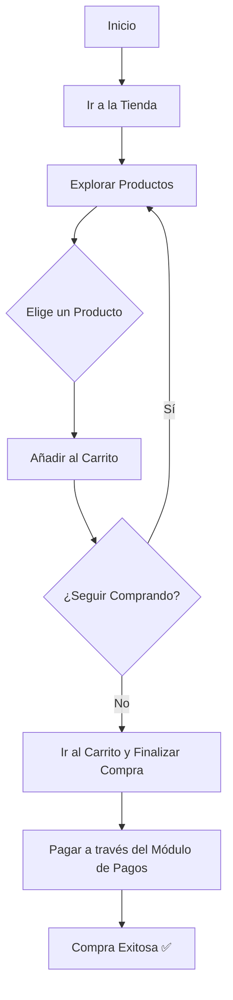

# Manual de Usuario: Módulo de Tienda (Store)

## 1. Propósito

Este módulo funciona como la tienda del club, donde puedes comprar productos como merchandising, equipamiento deportivo o snacks del buffet.

## 2. Roles Implicados

-   **Socio (`MEMBER`):** Puede explorar el catálogo y comprar productos.
-   **Administrador (`ADMIN`):** Gestiona el catálogo de productos, el inventario y ve los reportes de ventas.

---

## 3. Guía para Socios (Rol: `MEMBER`)

### 🔹 Cómo Comprar en la Tienda

**Paso a paso:**
1.  **Navega a la sección "Tienda"** en la aplicación.
2.  **Explora el catálogo de productos.** Puedes filtrarlos por categoría (ej: "Ropa", "Bebidas").
3.  **Haz clic en un producto** para ver sus detalles, como la descripción, el precio y las tallas disponibles.
4.  **Añade los productos** que deseas a tu carrito de compras.
5.  **Procede al pago.** Haz clic en el ícono del carrito y luego en "Finalizar Compra".
6.  Serás dirigido al **Módulo de Pagos** para completar la transacción. También podrías tener la opción de pagar con el saldo de tu billetera virtual.
7.  Una vez confirmado el pago, recibirás una confirmación y podrás retirar tu producto en el club.

### 🔹 Cómo Ver tu Historial de Compras

**Paso a paso:**
1.  Ve a la sección **"Mi Perfil"**.
2.  Busca la pestaña o el enlace a **"Mis Compras"**.
3.  Verás una lista de todos los productos que has comprado, con la fecha y el monto de cada transacción.

---

## 4. Guía para Administradores (Rol: `ADMIN`)

### 🔸 Cómo Añadir un Nuevo Producto

**Paso a paso:**
1.  **Accede al Panel de Administración** y ve a la sección de **"Tienda"**.
2.  Haz clic en **"Añadir Producto"**.
3.  **Completa el formulario:**
    -   Nombre del producto.
    -   Descripción.
    -   Precio.
    -   Categoría.
    -   **Stock inicial:** La cantidad de unidades disponibles.
    -   Sube una o más fotos del producto.
4.  **Guarda los cambios.** El producto estará visible inmediatamente en la tienda para los socios.

### 🔸 Cómo Gestionar el Inventario

**Paso a paso:**
1.  En el panel de la "Tienda", busca el producto cuyo stock deseas ajustar.
2.  Haz clic en **"Editar"** o en una opción específica de "Gestionar Stock".
3.  **Actualiza el número de unidades disponibles.** El sistema también descontará el stock automáticamente con cada venta.
4.  Puedes configurar alertas para que el sistema te notifique cuando el stock de un producto esté bajo.

---

## 5. Diagrama de Flujo: Compra de un Producto (Socio)

